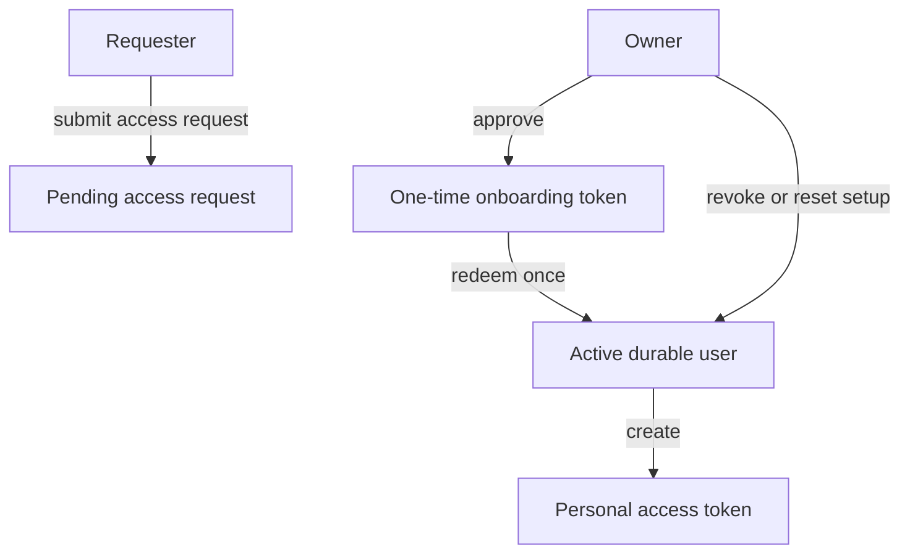

# Managing Authentication

This guide is for operators who want durable accounts instead of one shared session password.

## Prerequisites

- You have already served the workspace at least once with Qit.
- You can open the local Web UI as the operator, or you can run `qit auth ...` commands against that workspace.
- You understand the difference between shared-session and request-based auth. If not, read [sharing and auth](/docs/sharing-and-auth) first.

## Choose the right mode

| Mode | Best for | What users authenticate with |
| --- | --- | --- |
| `shared-session` | Fast temporary sharing, demos, low-friction local work | One process-scoped username and password shared by collaborators |
| `request-based` | Durable collaboration, approvals, revocation, per-user access, PATs | Per-user username plus password or PAT |

Switch a served workspace to request-based mode:

```bash
qit auth mode ./my-app --request-based
```

Or start the workspace that way from the beginning:

```bash
qit --transport local --auth-mode request-based ./my-app
```

## Understand the request-based flow



The important rule is that approval alone does not create a usable account. Approval only creates a user in `approved_pending_setup` state and issues a one-time onboarding token. The user becomes active only after redeeming that token.

## Inspect the current auth state

Use these commands to see what exists now:

```bash
qit auth mode ./my-app
qit auth requests ./my-app
qit auth users ./my-app
qit auth pats ./my-app
```

These commands are read-oriented unless you pass a mutating flag such as `--approve` or `--revoke`.

## Approve or reject access requests

When request access is enabled, collaborators submit name and email details through the Web UI.

List pending requests:

```bash
qit auth requests ./my-app
```

Approve a request:

```bash
qit auth requests ./my-app --approve 1a2b3c4d
```

Reject a request:

```bash
qit auth requests ./my-app --reject 1a2b3c4d
```

After approval, Qit prints a one-time onboarding token. Share it with the approved user immediately. Qit does not show that raw token again later.

## Complete onboarding

The approved user redeems the onboarding token in the Web UI by choosing:

- a username
- a password of at least 10 characters

After that:

- the account status becomes `active`
- the chosen username becomes the durable login name
- the password is stored only as a verifier

## Manage durable users

List users:

```bash
qit auth users ./my-app
```

Promote a user to owner:

```bash
qit auth users ./my-app --promote 1a2b3c4d
```

Demote an owner back to user:

```bash
qit auth users ./my-app --demote 1a2b3c4d
```

Revoke a user:

```bash
qit auth users ./my-app --revoke 1a2b3c4d
```

Reset a user's setup:

```bash
qit auth users ./my-app --reset-setup 1a2b3c4d
```

### What each action does

| Action | Result |
| --- | --- |
| Promote | Changes the user's role to `owner`. |
| Demote | Changes the user's role to `user`. |
| Revoke | Marks the user revoked, clears password login, and revokes active PATs. |
| Reset setup | Clears username/password, invalidates active PATs, and prints a fresh onboarding token. |

Qit refuses to demote or revoke the last durable owner.

## Personal access tokens

Personal access tokens are for Git access in request-based mode.

Important details:

- active users create PATs from the Web UI
- the raw PAT secret is shown exactly once when created
- PATs are stored only as verifiers
- operators can list and revoke PATs from the CLI

List active PATs:

```bash
qit auth pats ./my-app
```

Revoke a PAT:

```bash
qit auth pats ./my-app --revoke 1a2b3c4d
```

After revocation, Git authentication with that PAT fails immediately.

## Shared-session versus request-based behavior

| Behavior | Shared-session | Request-based |
| --- | --- | --- |
| Git login | Shared generated username/password | Per-user username + password or PAT |
| Web UI login on exposed hosts | Shared session login | Per-user login |
| Durable user accounts | No | Yes |
| Access approval workflow | No | Yes |
| PAT support | No | Yes |
| Owner demotion/revocation rules | No durable owners | Last durable owner cannot be removed |

## Safe operating rules

- Use shared-session only for short-lived, low-risk collaboration.
- Use request-based mode for any workspace where you need accountability or revocation.
- Record onboarding tokens carefully; Qit intentionally does not persist the raw secret in recoverable form.
- Prefer PATs for automation and headless Git use.

## Common operator mistakes

### Expecting approval to be enough

Approval does not activate the account. The user still needs to redeem the onboarding token.

### Losing the onboarding token

If you lose it, reset setup for that user and distribute the new token:

```bash
qit auth users ./my-app --reset-setup 1a2b3c4d
```

### Expecting the old shared password to keep working

After switching a workspace to request-based mode, shared basic auth is no longer the login path unless you explicitly enable `basic-auth`.

## Related pages

- [CLI reference](/docs/reference/cli)
- [The sidecar model](/docs/concepts/sidecar-model)
- [Troubleshooting and recovery](/docs/troubleshooting/recovery)
