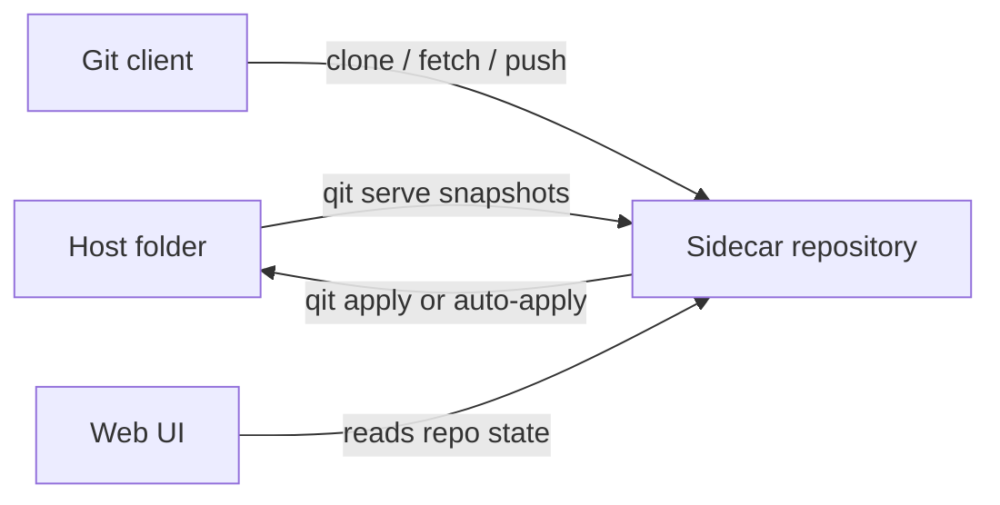

# The Sidecar Model

Qit is not a thin wrapper around `git init`. Its core design decision is that the folder you are editing stays a normal folder, while Git history lives in a separate sidecar repository.

If you do not understand this split, the rest of Qit will feel surprising. If you do understand it, most of Qit's behavior becomes predictable.

## The three surfaces

### Host folder

This is the directory on disk that you point Qit at.

- It remains readable by normal local tools.
- It does not need its own `.git` directory.
- Incoming collaborator pushes do not write here immediately.

### Sidecar repository

This is the Git repository Qit creates and manages outside the host folder.

- Qit snapshots the host folder into it.
- Collaborators clone, fetch, and push against it.
- Pull requests, issues, auth state, and repository settings are attached to the workspace metadata that travels with this served repo.

### Web UI

The Web UI is another view onto the same workspace state.

- It reads commits, branches, pull requests, issues, settings, and auth state.
- It does not replace Git transport.
- It exists to browse, review, and administer the workspace.

## Why Qit uses a sidecar

Qit chooses separation over immediacy.

- The host folder stays safe until you deliberately apply incoming work.
- Collaborators still get a normal Git remote.
- The operator can review sidecar state before mutating the host files.
- Qit can support a served branch and a checked-out branch without pretending the host folder is a full multi-branch Git working copy.

## Snapshot, push, apply

The core lifecycle is:

1. `qit` snapshots the host folder into the sidecar repository.
2. Collaborators push into the sidecar repository.
3. You inspect the resulting state in the CLI or Web UI.
4. You run `qit apply` or let `--auto-apply` fast-forward the host folder when it is safe.

That means a successful push does **not** imply that the host folder changed.

## Exported branch versus checked-out branch

Qit tracks two branch ideas at once.

| Term | Meaning |
| --- | --- |
| Exported branch | The branch new clones see by default and the branch the workspace advertises as its served default. |
| Checked-out branch | The branch whose contents are currently materialized in the host folder. |

These branches are often the same, but they do not have to be.

### `qit checkout`

`qit checkout <path> <branch>` changes the checked-out host branch and leaves the exported branch alone.

Use this when you want to inspect or edit another branch locally without changing what collaborators see as the main served branch.

### `qit switch`

`qit switch <path> <branch>` changes both branches together.

Use this when the served default branch itself should move.

## What `apply` actually means

`qit apply` does not merge arbitrary state into the host folder. It fast-forwards the host folder to a sidecar branch.

That has several consequences:

- Apply is intentionally conservative.
- A dirty host folder blocks apply.
- A non-fast-forward update blocks apply.
- Applying a different branch changes the checked-out host branch metadata to match the branch that now owns the files on disk.

## What `--auto-apply` actually means

`--auto-apply` is not a promise that every push will rewrite the host folder immediately.

It only applies when the update is safe:

- the host folder is clean relative to the last applied state
- the apply is a fast-forward
- the checked-out branch and served branch are aligned for the update

If those conditions are not true, the push still lands in the sidecar repository and waits there.

## Existing Git worktrees

Qit can serve a folder that already has its own `.git` directory, but only when you opt in with `--allow-existing-git`.

In that mode:

- Qit snapshots the checked-out branch of the existing worktree
- Qit skips the existing `.git` metadata
- Qit still keeps its own sidecar repository outside the host folder

Qit is not reusing the host repo as its collaboration store. It is still using the sidecar model.

## Mental model to keep

When something in Qit feels confusing, ask this question:

> Am I looking at the host folder, or am I looking at sidecar state that has not been applied yet?

That question explains most surprises around pushes, branch changes, and review flow.

## Related pages

- [CLI reference](/docs/reference/cli)
- [Sharing and auth](/docs/sharing-and-auth)
- [Troubleshooting and recovery](/docs/troubleshooting/recovery)
